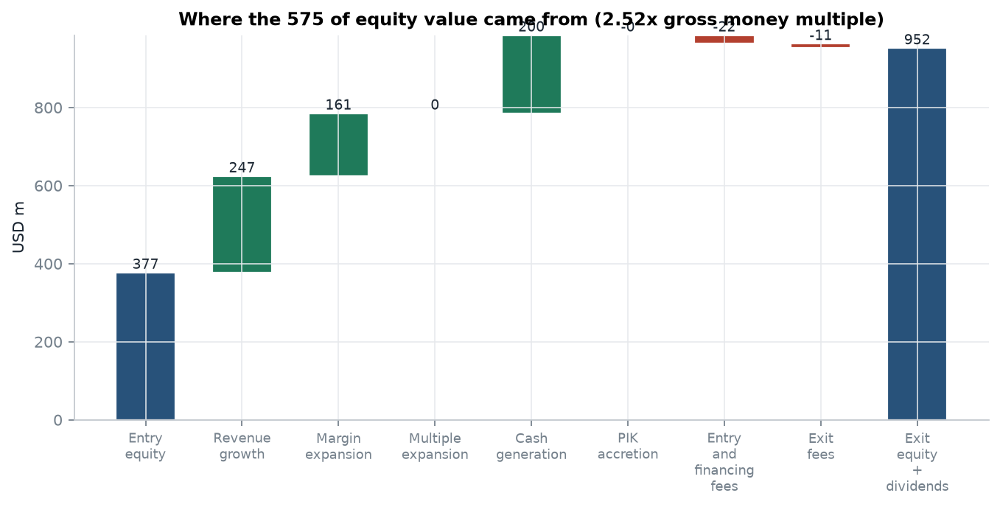
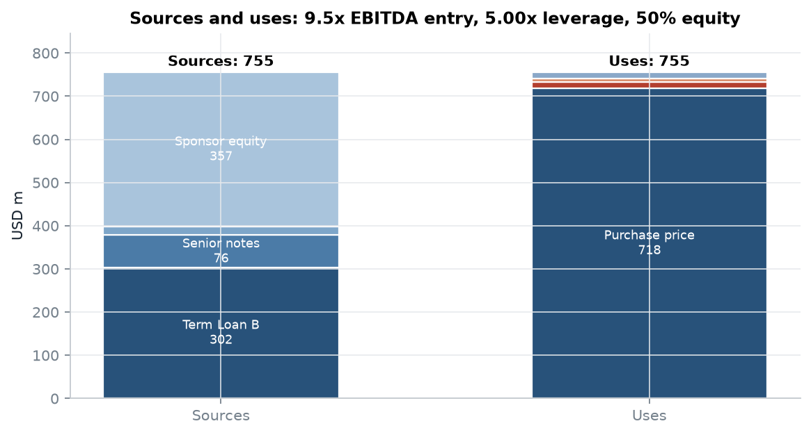
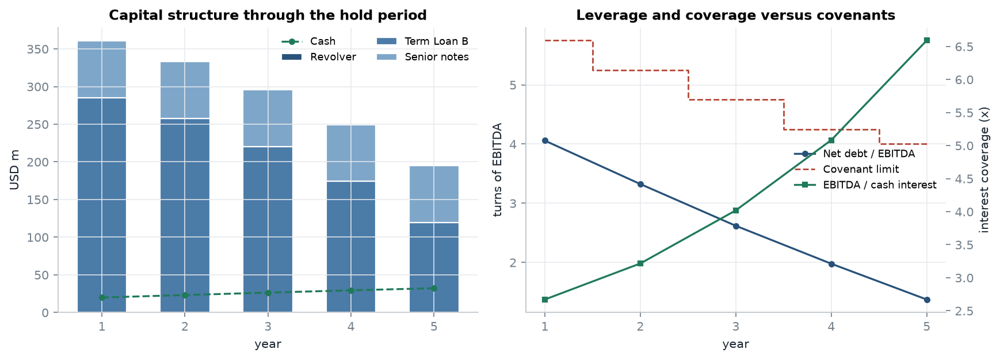
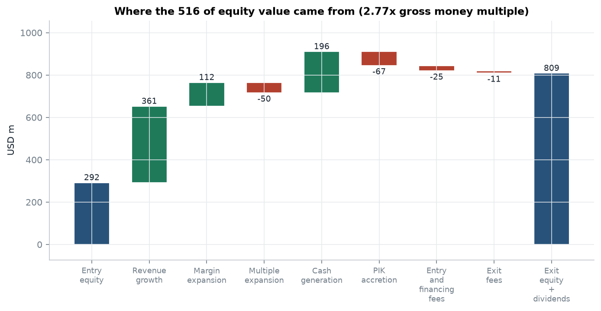
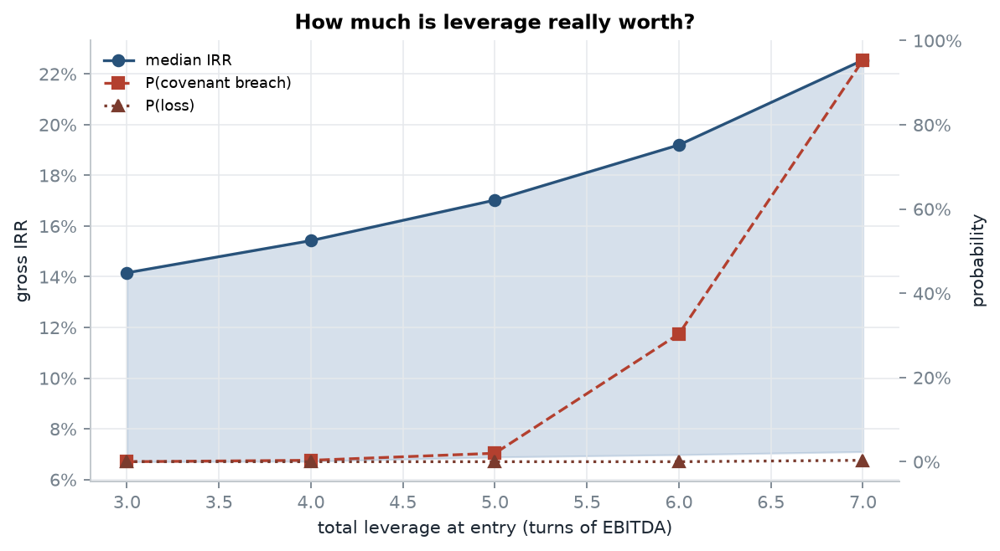
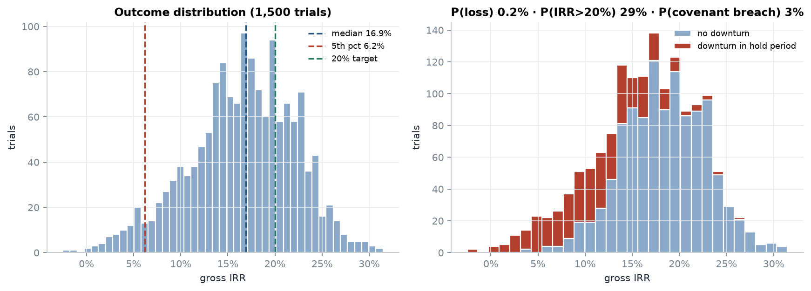
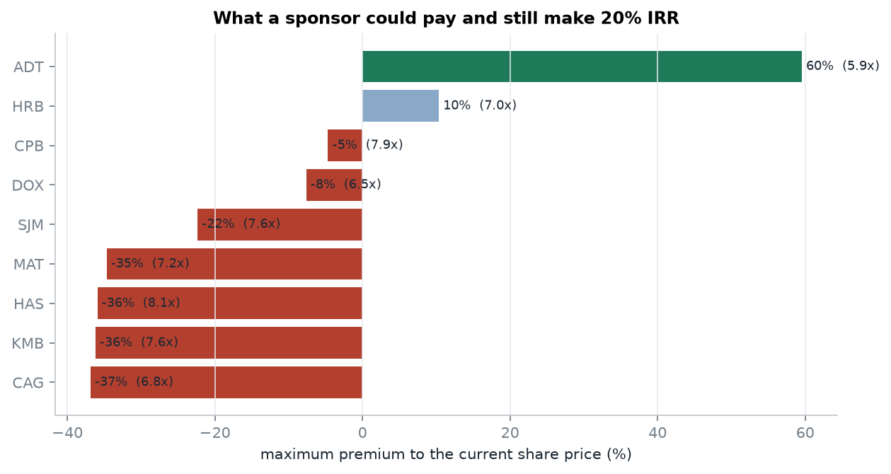
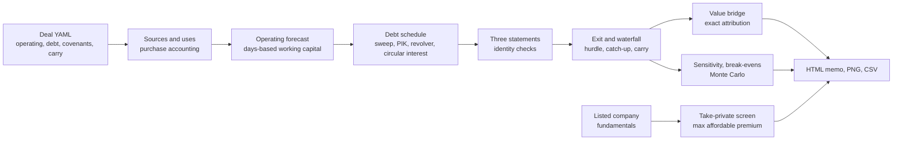

# LBO Returns Engine

[](https://github.com/elmarfarajov/lbo-returns-engine/actions/workflows/ci.yml)


**A leveraged buyout model that has to prove itself: every accounting identity is checked, the value
bridge reconciles exactly, and the answer to "how much is leverage really worth?" is simulated rather
than asserted.**

The engine takes a deal - operating plan, capital structure, covenants, fee and carry terms - and produces
the full model: sources and uses, three statements, a debt schedule with cash sweep and PIK accrual, an
exit waterfall with carried interest, a value-creation bridge, sensitivity grids, a Monte Carlo of outcomes,
and a public-to-private screen that asks what a sponsor could pay for a listed company today.



---

## The worked deal

`deals/helios_carveout.yaml` is a corporate carve-out bought at 9.5x EBITDA with 5.0x leverage and held
five years. The sponsor underwrites 6% average revenue growth and a 300 basis point margin improvement,
and sells at the entry multiple.

| | Result |
|---|---|
| Purchase price / equity cheque | 718 / 377 (50% equity) |
| Gross money multiple and IRR | **2.37x, 18.9%** |
| Net of fees and carried interest | **2.10x, 16.0%** |
| Leverage at entry and exit | 4.06x net, falling to **1.37x** |
| Kaplan-Schoar PME vs a 9% index | **1.54** (direct alpha +9.0%) |
| Monte Carlo, 2,000 trials | median IRR 16.9%, P(loss) 0.2%, **P(covenant breach) 2.6%** |

<p align="center">
  
  
</p>

### Finding 1: the returns are made in the business, not in the multiple

The bridge above is an exact identity - it reconciles to 2e-13 - and it splits the 575 of equity value
created into its sources:

| Source | Value | Share |
|---|---:|---:|
| Revenue growth | 247 | 43% |
| Margin expansion | 161 | 28% |
| Cash generation (deleveraging) | 200 | 35% |
| Multiple expansion | 0 | 0% |
| Fees (transaction, financing, exit) | -33 | -6% |

Expressed as return, growth and margin are worth 15.8 points of the 20.3% whole-equity return and
deleveraging another 5.4, with fees giving back 0.8. The sponsor keeps 18.9% of that after the management
incentive plan. The second example deal, an aggressive roll-up at 6.5x with a PIK note and a
dividend recap, tells the opposite story - a 0.5x multiple contraction costs 50 and PIK accretion another
67 of value, which is why its 22.3% gross IRR falls to 17.8% net.

<p align="center"></p>

### Finding 2: leverage buys a few points of return and a lot of tail risk



Re-underwriting the same business at different leverage levels, with 400 simulations each:

| Total leverage | Median IRR | 5th percentile | P(covenant breach) |
|---|---:|---:|---:|
| 3.0x | 14.1% | 6.5% | 0.0% |
| 4.0x | 15.4% | 6.6% | 0.3% |
| 5.0x | 16.9% | 6.7% | **2.8%** |
| 6.0x | 19.2% | 6.8% | **28.0%** |
| 7.0x | 22.3% | 6.8% | **95.5%** |

Going from five to seven turns adds 5.4 points of median IRR. It also takes the chance of breaching a
maintenance covenant from 3% to 96%, and does nothing whatsoever for the downside: the 5th percentile
outcome moves from 6.7% to 6.8%. Leverage magnifies the cases that were already working; in the cases
that were not, the debt is still there. The
distribution behind those numbers is driven by a downturn hitting in a random year, which is what
actually tests a capital structure:



### Finding 3: what could a sponsor pay for a listed company today?

The screen solves for the highest premium to the current share price that still clears a 20% IRR,
assuming an exit at the company's own current trading multiple, with leverage cut back to whatever passes
an interest coverage test. Run on 18 September 2026:



| Company | EV/EBITDA | Financeable leverage | IRR at market price | Max premium |
|---|---:|---:|---:|---:|
| ADT | 4.8x | 4.5x | 52.8% | **+60%** |
| H&R Block | 6.5x | 5.0x | 26.7% | **+10%** |
| Campbell's | 8.0x | 5.0x | 18.7% | -5% |
| Amdocs | 7.0x | 5.0x | 14.6% | -8% |
| J.M. Smucker | 8.9x | 5.0x | 11.5% | -22% |
| Kimberly-Clark | 11.0x | 5.0x | 3.3% | -36% |
| ConAgra | 8.3x | 5.0x | 7.8% | -37% |

Only two of the twelve names screened could be bought at a premium and still return 20%. ADT stands out
because it trades at under five times EBITDA - and note what the model does with it: leverage is trimmed
to 4.5x because five turns fails the coverage test, and the full model of that deal shows the trade-off in
miniature, where adding a turn of debt is worth 13.3 IRR points and takes the probability of losing money
to 10.6%. Whirlpool and Newell come back as unfinanceable at any price: their existing net debt is so
large that the structure cannot be funded even at a discount. A delisted ticker in the list was skipped
with a warning rather than crashing the run.

### Gross versus net: what the investor actually keeps

| | Helios carve-out | Apex roll-up |
|---|---:|---:|
| Whole-equity return | 20.3% | 22.6% |
| Management incentive plan | -1.5 pts | -0.3 pts |
| **Sponsor gross IRR** | **18.9%** | **22.3%** |
| Carried interest and management fees | -2.9 pts | -4.4 pts |
| **Net IRR to investors** | **16.0%** | **17.8%** |

---

## What is inside



| Module | Contents |
|---|---|
| `assumptions.py` | Typed, validated deal definition; YAML loader; tranche sizing in turns of EBITDA |
| `model.py` | Sources and uses, purchase accounting, operating forecast, debt schedule, three statements, covenant tests |
| `returns.py` | IRR, XIRR, MOIC, management incentive plan, fund waterfall with preferred return and catch-up, Kaplan-Schoar PME, direct alpha |
| `bridge.py` | Exact value-creation attribution and its IRR-equivalent decomposition |
| `sensitivity.py` | One interface for shifting any assumption: two-way grids, lever ranking, break-even solver |
| `montecarlo.py` | Persistent and annual growth surprises, margin delivery, exit multiple, rates, and downturn scenarios |
| `screener.py` | Yahoo Finance fundamentals, credit-capacity test, maximum affordable premium solver |
| `pipeline.py`, `report.py`, `figures.py` | End-to-end analysis and a self-contained HTML investment memo |
| `validation.py` | 21 independent checks of the accounting and the return mathematics |
| `app/streamlit_app.py` | Deal cockpit: move an assumption, watch the debt schedule, bridge and risk move |

## Engineering decisions worth noting

- **The circular reference is solved, not avoided.** Interest accrues on average balances, which depend on
  the sweep, which depends on interest. Each year is solved by fixed-point iteration to 1e-10, converging
  in about ten passes, and the result is checked against the closed form
  `I = r(2B - EBITDA)/(2 - r)` for the single-tranche case.
- **Identities are output, not assumptions.** The balance sheet and cash flow statement are re-derived and
  their residuals reported every year (worst case 2e-13). A silent error in the debt schedule cannot hide.
- **The attribution is algebra, not allocation.** The bridge is derived from the definitions of entry and
  exit equity, so it reconciles exactly; the residual is printed with every run.
- **Return measures refuse to lie.** IRR returns NaN when the cash flows never change sign instead of
  inventing a root, and the break-even solver returns NaN when no value in range reaches the target.
- **Gross is never reported alone.** Every headline comes with the net figure after the management
  incentive plan, management fees and carried interest on a whole-of-deal waterfall.
- **Downside is modelled explicitly.** Symmetric noise never breaches a covenant; recessions do. The
  simulation puts a downturn in a random year with a configurable probability.

## Validation

`lbolab validate` runs 21 checks; the full table is in [docs/VALIDATION.md](docs/VALIDATION.md).

| Check | Reference | Residual |
|---|---|---|
| Sources equal uses | identity | 0 |
| Balance sheet balances every year | identity | 2e-13 |
| Cash flow statement ties to cash | identity | 1e-14 |
| Interest recomputed from average balances | independent recomputation | 4e-12 |
| Circularity solver | closed form | 4e-13 |
| Value bridge | exact identity | 2e-13 |
| IRR against MOIC and a closed form | 14.8698% for doubling in five years | 2e-16 |
| Carried interest algebra | 20% of profit beyond the catch-up | 0 |
| PME with an index at the deal's own IRR | exactly 1.00 | 2e-16 |
| All-equity deal | hand calculation | 1e-16 |
| Premium solver round trip | reproduces a 20% IRR | 2e-11 |
| YAML deals | match the Python examples | identical |

101 tests (unit, accounting, statistical and end-to-end, including the dashboard) run on Python
3.10-3.12 in CI alongside linting and the validation suite.

## Quickstart

```bash
git clone https://github.com/elmarfarajov/lbo-returns-engine.git
cd lbo-returns-engine
python -m venv .venv
source .venv/bin/activate          # Windows: .venv\Scripts\activate
pip install -e ".[dev,app]"
```

```bash
# The bundled examples, fully offline
lbolab demo --example helios --out reports/helios
lbolab demo --example apex --out reports/apex

# Your own deal
lbolab run deals/helios_carveout.yaml --out reports/deal

# Take-private screen on live fundamentals
lbolab screen --tickers ADT HRB KMB SJM CAG --target-irr 0.20 --out reports/screen

# Checks and tests
lbolab validate
pytest

# Interactive deal cockpit
streamlit run app/streamlit_app.py
```

Each run writes `report.html` (an investment memo with every table and figure embedded), the model
schedule, the value bridge, the lever table and the Monte Carlo trials as CSV.

A deal is a readable file, so the assumptions are auditable:

```yaml
exit:
  hold_years: 5
  entry_multiple: 9.5
  exit_multiple: 9.5
financing:
  cash_sweep_pct: 0.75
  tranches:
    - name: Term Loan B
      turns: 4.00          # sized in turns of entry EBITDA
      spread: 0.0425       # over the base-rate curve
      amortisation_pct: 0.01
      sweep_priority: 2
```

## Project layout

```
lbo-returns-engine/
├── src/lbolab/          # library (13 modules, see table above)
├── app/                 # Streamlit deal cockpit
├── deals/               # worked deals in YAML, checked against the code examples
├── tests/               # 101 tests: accounting identities, returns, risk, CLI, dashboard
├── docs/
│   ├── METHODOLOGY.md   # derivations, conventions, limitations, references
│   ├── VALIDATION.md    # the 21 checks and their residuals
│   └── images/          # figures used in this README
└── .github/workflows/   # lint + tests on three Python versions + validation
```

## Limitations and next steps

- A covenant breach is flagged, not resolved: no amend-and-extend, equity cure or restructuring.
- Taxes are a single rate with loss carryforwards; interest deductibility caps and cross-border
  structuring are not modelled.
- Exit timing is an input rather than a decision; the lever table shows what a year of patience costs.
- Screen fundamentals are unaudited Yahoo Finance data, so the output is a shortlist, not a valuation.
- Natural extensions: add-on acquisitions with multiple arbitrage, continuation vehicles, and fund-level
  aggregation across several deals with a real management fee and carry schedule.

Full derivations and conventions: [docs/METHODOLOGY.md](docs/METHODOLOGY.md).

## About

Built by Elmar Farajov as an independent quantitative finance project, after
[Portfolio-analyzer](https://github.com/elmarfarajov/Portfolio-analyzer) (portfolio risk and fixed income),
[equity-valuation-engine](https://github.com/elmarfarajov/equity-valuation-engine) (DCF and Monte Carlo
valuation) and [volatility-surface-lab](https://github.com/elmarfarajov/volatility-surface-lab) (options
and stochastic volatility). Research and educational use only; not investment advice.
Licensed under [MIT](LICENSE).
